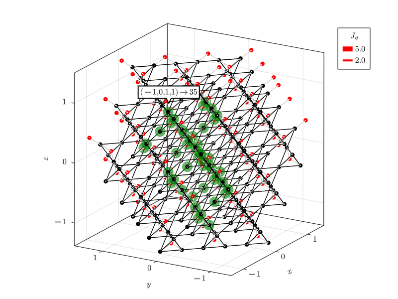

# VestaToSpinFRGLattices.jl: import lattices from Vesta to Spin FRG
## Usage:
**WARNING**: This package is experimental!
  

To visualize the correct implementation of a lattice and its symmetries we use `FRGLatticePlotting.jl` so that
```julia
import VestaToSpinFRGLattices as Vesta
using VestaToSpinFRGLattices
using SpinFRGLattices
using FRGLatticePlotting
Basis = getBasis("test/CentredPyrochlore.vesta")
CPyro = generateSystem(10,"test/CentredPyrochlore.vesta")
setNeighborCouplings!(CPyro,[5,2.],Basis)

Bonds = Vesta.readBonds("test/CentredPyrochlore.vesta")
plotSystem(CPyro,Basis;refSite = 1,bondDist = Basis.NNdist,markersize = 12,Bonds,plotAll = true,plotCouplings = true,bondlw = (1,0.3))
```
produces the following plot:

